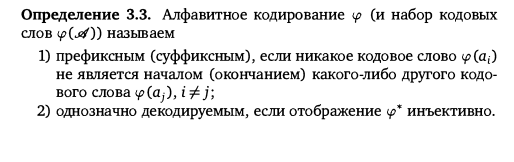

#### Вопрос 01

#### Задача оптимального кодирования. Понятие кодера и декодера. Однозначная декодируемость. Префиксные коды. Схема кодирования. Равномерные и неравномерные коды. Средняя длина кодового слова. Степень сжатия. Понятие оптимального кода.

- Кодер источника служит для преобразования сообщений в кодовые символы с целью уменьшения избыточности источника сообщения, т.е. обеспечении минимума среднего числа символов на одно сообщение и представления в удобной форме (например, в виде двоичных чисел).

- Декодер источника (ДИ) – это устройство для преобразования последовательности первичного электрического сигнала безизбыточного кода в сообщение.

